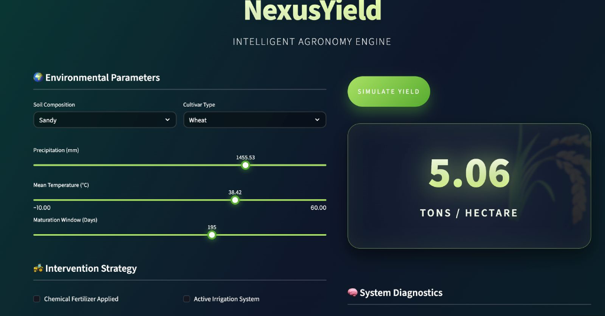
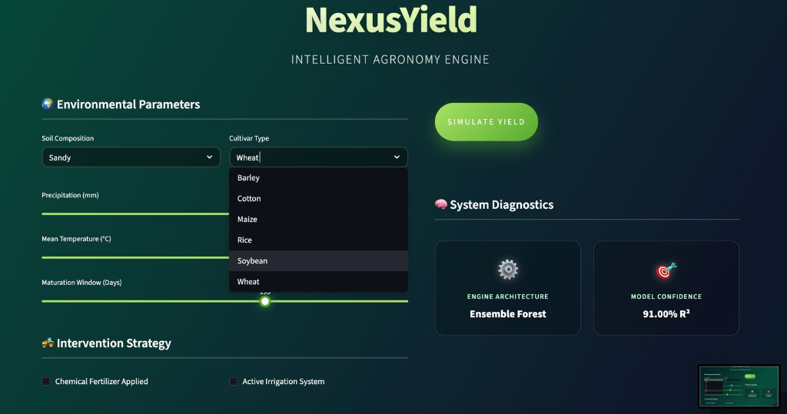
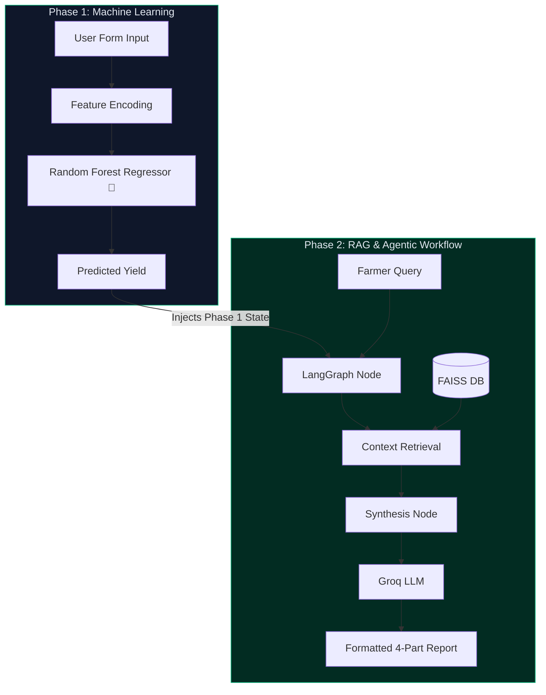

<div align="center">
  <h1>🌾 NexusYield Enterprise</h1>
  <h3><i>Agentic AI Farm Advisory Assistant — Capstone Milestone 2</i></h3>
  
  <p align="center">
    
    
    
    
    
  </p>
</div>

---

## 📖 Overview

**NexusYield** is an end-to-end Machine Learning and Agentic AI system designed for extreme agronomic efficiency. It predicts exact crop yield (Tons/Hectare) using Random Forest models, and then leverages a **LangGraph-powered Retrieval-Augmented Generation (RAG)** pipeline to provide hallucination-free, structured farming advice.

---

## 📸 Application Preview

*(If you are setting up locally, the animated Dark Glassmorphism UI will initialize instantly).*

| Phase 1: Machine Learning Evaluation | Phase 2: LangGraph Advisory Agent |
| :---: | :---: |
|  |  |

> *Note: UI captures reflect the dynamic glassmorphism and pulsing metrics engine built purely via CSS injection within Streamlit.*

---

## ⚡ Core Architecture

NexusYield operates in **Two Synchronized Phases**:

### 📊 Phase 1: Machine Learning Evaluation
- **Simulated Predictions:** Predicts yield based on 7 interactive environmental parameters (Soil, Rain, Temp, etc.).
- **Live Explainability:** Generates a real-time `Feature Impact Matrix` using scikit-learn.

### 🤖 Phase 2: LangGraph Advisory Agent
- **Explicit State Routing:** The Agent physically cannot hallucinate advice; it inherits the exact Yield state from Phase 1.
- **Offline FAISS Indexing:** Embeds 6 full agronomic manuals directly into a local vector space using `SentenceTransformers`.
- **Structured Outputs:** Automatically formats outputs into `Status`, `Advice`, `Sources`, and `Disclaimer` using Groq's `llama-3.3-70b-versatile`.

---

## 🛠 System Intelligence Pipeline



---

## 📂 Project Structure

```text
genai_capstone/
├── data/
│   └── crop_yield.csv              # Underlying dataset for failsafe training
├── models/
│   ├── docs.pkl                    # Chunked Agricultural Manuals
│   ├── faiss_index.bin             # Heavy RAG Vector Index
│   └── ...                         # Local ML Weights
├── src/
│   ├── agent.py                    # LangGraph State Manager
│   ├── ingest_faiss.py             # Offline embedding engine
│   └── train_local.py              # Auto-failsafe mechanism for cloud booting
├── app.py                          # Premium Streamlit UI Endpoint             
├── requirements.txt
└── README.md
```

---

## 🚀 Deployment Highlights

> Designed strictly to meet Enterprise Agritech standards.

- **Auto-Deployment Failsafe**: GitHub ignores the 100MB+ `model.pkl` to prevent blockages. When deployed to **Streamlit Community Cloud**, the server detects the missing models and silently executes `src/train_local.py` to auto-build them in seconds!
- **Strict Guardrails**: By leveraging LangGraph, we strictly restrict the LLM to context retrieved from the FAISS vector database.

---
<div align="center">
  <b>Built for Capstone Milestone 2</b>
</div>
