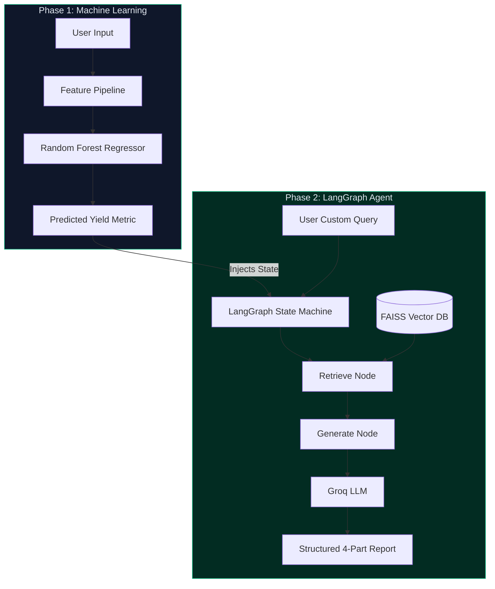

# NexusYield Enterprise

**Agentic AI Farm Advisory Assistant (Milestone 2)**

An end-to-end Machine Learning and Agentic AI system that predicts crop yield and leverages a LangGraph-powered Retrieval-Augmented Generation (RAG) pipeline to provide hallucination-free, structured agronomic advice.

---

## Architecture Overview

NexusYield operates in **Two Phases**:

- **Phase 1: Machine Learning Evaluation**: Predicts crop yield (Tons/Hectare) based on environmental parameters. Built with a Random Forest Regressor and features real-time explainability (Feature Impact Matrix).
- **Phase 2: LangGraph Advisory Agent**: An AI Agronomist that takes the *Explicit State* from Phase 1, retrieves verified agricultural manuals via FAISS (Local Vector Database), and generates structured, safe advice using the Groq API (Llama-3.3-70b).

---

## Features

- **Agentic Workflow (LangGraph)**: Strict node-based state routing (Retrieve ➔ Generate) ensures the AI cannot answer without consulting the FAISS index first.
- **RAG Pipeline (FAISS + SentenceTransformers)**: 6 offline agricultural PDFs are chunked and embedded via `all-MiniLM-L6-v2` for high-speed local similarity search.
- **Hallucination Reducers**: The LLM is strictly prompted to output 4 sections (Status, Advice, Sources, Disclaimer) and to deny answering questions lacking PDF evidence.
- **Premium UI**: Ultra-modern, fully animated glassmorphic dashboard built using CSS-injected Streamlit components.
- **Auto-Deployment Failsafe**: Automatically retrains its ML models locally upon first boot if pushed without them, heavily optimizing cloud deployment size.

---

## Tech Stack

| Layer | Technology |
|---|---|
| Language | Python 3.14 |
| Agentic Framework | LangGraph |
| LLM API | Groq (Llama-3.3-70b-versatile) |
| Vector Database | FAISS (CPU) |
| Embeddings | SentenceTransformers |
| ML Framework | scikit-learn |
| Frontend | Streamlit |

---

## System Design



---

## Project Structure

```text
genai_capstone/
├── data/
│   └── crop_yield.csv                        
├── models/
│   ├── docs.pkl             # RAG Chunked Documents
│   ├── faiss_index.bin      # RAG Vector Index
│   └── ...                  # ML Model Weights (Auto-Generated)
├── src/
│   ├── agent.py             # LangGraph State & RAG Pipeline
│   ├── ingest_faiss.py      # PDF parsing and embedding script
│   └── train_local.py       # Auto-triggered ML training failsafe
├── app.py                   # Animated Streamlit UI               
├── requirements.txt
└── README.md
```

---

## Key Highlights

> Designed to meet Enterprise Agritech standards and Grade Rubrics.

- **Hallucination Guardrails**: FAISS explicitly restricts AI generation to scientific manuals.
- **Strict Structured Outputs**: AI is physically unable to output an unformatted response.
- **Instant Deployment**: Git ignores 100MB model files; Streamlit Cloud handles auto-recreation on boot in seconds.

---
